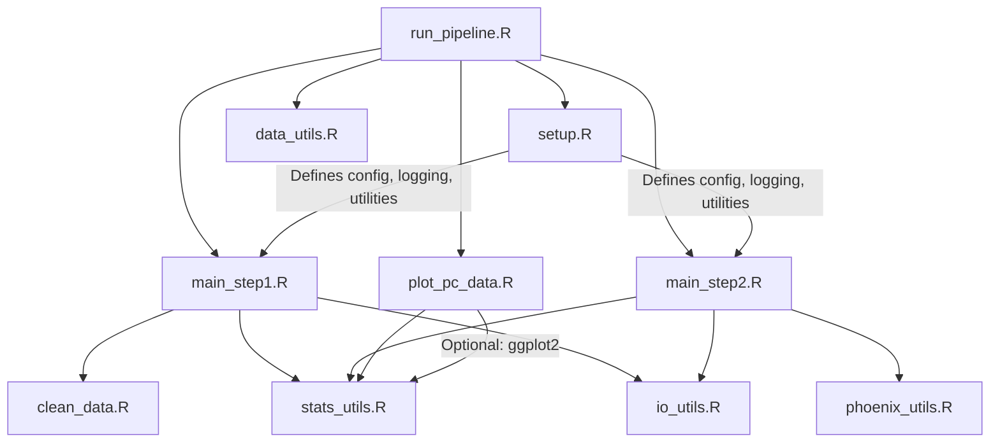

# PK Data Processing Pipeline

A modular R pipeline for pharmacokinetic (PK) data: raw data cleaning, Phoenix WinNonlin output processing, summary statistics, and reporting.

## Features
- Clean and map raw PK concentration data
- Process Phoenix WinNonlin outputs and (optionally) summary tables
- Generate arithmetic and geometric summary statistics
- Apply diagnostic exclusion criteria (Rsq, AUC%Extrap)
- Export results to Excel/CSV (multi-sheet)
- Comprehensive logging

## Quick Start

1. **Install required packages:**
   ```r
   install.packages(c("dplyr", "tidyr", "purrr", "openxlsx", "fs"))
   ```

2. **Configure your analysis:**  
   Edit `data_utils.R` for input/output files, column mappings, grouping variables, and settings.

3. **Run the pipeline:**
   ```r
   source("run_pipeline.R")  # Main entry point: runs all steps in order
   ```

   - `run_pipeline.R` will source `setup.R` and `data_utils.R` first to initialize the environment, then run all pipeline steps in sequence.
   - **Do not source `setup.R` or any utility/config scripts in step scripts.**
   - All utility functions are available globally after initialization.

## Data & Configuration

- **All configuration is handled in `data_utils.R`.**
  - File paths, column mappings, grouping variables, BLOQ/zero handling, and diagnostic criteria are set here.
  - Review and update the config list for each analysis.
- **Required columns:** `Subject`, `Time`, `Concentration`, `Cohort` (or mapped equivalents)
- **Grouping variables:**  
  - PC data: `pc_time_group_vars`, `pc_nontime_group_vars`
  - Phoenix parameters: `pp_group_vars`
- **Summary table:** Optional. If enabled, must contain `Subject`, `Time`, `Concentration` (and grouping variables). Controlled by `import_summary_table` in config.
- **Config options:**  
  Set in `data_utils.R` (see in-file comments for details)
  - `import_summary_table`: Set to `FALSE` to skip importing the summary table and pulling CXX/Cmax/CXX columns in the Phoenix step. Only the main Phoenix output will be processed.

## Outputs

- **Step 1 (PC Data):**  
  - `Output_files/Step_1/`: Cleaned CSV, wide-format Excel, summary Excel, BLOQ0 CSV
- **Step 2 (Phoenix Parameters):**  
  - `Output_files/Step_2/`: Individual values Excel, summary Excel (with units), CXX and Cmax/CXX columns (if `import_summary_table = TRUE`)
- **Logging:**  
  - `Output_files/log/`: Timestamped log files

## File Structure

```
Pk_pipeline/
├── run_pipeline.R        # Main entry point: runs all steps
├── setup.R               # Environment, config, and utility initialization
├── main_step1.R          # Step 1: Data cleaning & PC summary
├── main_step2.R          # Step 2: Phoenix processing & summary
├── data_utils.R          # Configuration
├── clean_data.R          # Data cleaning functions
├── phoenix_utils.R       # Phoenix output processing
├── stats_utils.R         # Statistical analysis
├── io_utils.R            # Input/output utilities
├── plot_pc_data.R        # Plotting script
├── misc/                 # Supporting files (e.g., column lookup)
├── Output_files/
│   ├── Step_1/           # Step 1 outputs
│   ├── Step_2/           # Step 2 outputs
│   └── log/              # Log files
└── Input_files/          # Raw data files
```

## Project Architecture & Dependency Map



> **Note:**
> All utility scripts (`clean_data.R`, `phoenix_utils.R`, `stats_utils.R`, `io_utils.R`) are sourced by `setup.R` and are available globally. Step scripts (`main_step1.R`, `main_step2.R`, `plot_pc_data.R`) do **not** source any utility/config scripts themselves; they only use the functions made available by `setup.R`. The arrows from step scripts to utility scripts represent usage (function calls), not direct sourcing.

## Key Implementation Details

- **Centralized utility functions** are used for:
  - Output writing (`write_excel_outputs`, `write_csv_output`, `write_standardized_excel`)
  - Unit row generation (`generate_unit_row`)
  - Parameter-to-unit matching (`match_parameter_units`)
  - Data splitting and wide-format transposition (`split_data_for_output`, `transpose_wide_by_subject`)
  - Summary statistics (`summarize_stats_generic`)
- **No duplicated logic** for unit row or parameter-unit matching; all scripts use the utilities.
- **BLOQ/zero handling:**
  - In Step 1, BLOQ values before the first measurable concentration are set to 0.
  - If **all** concentrations in a group are BLOQ, **all are set to 0** (not NA).
- **Grouping variable handling** is robust for any number of variables, using `!!!rlang::syms()` for grouping and arranging.
- **Time points:** Set `summary_time_points` in config to extract CXX and Cmax/CXX columns (only if `import_summary_table = TRUE`)
- **Exclusion criteria:**  
  - `RG` flag: Rsq_adjusted < threshold (excludes select parameters)
  - `EX` flag: AUC%Extrap_obs > threshold (excludes select parameters)
- **Summary table import:** Controlled by `import_summary_table` in config. If `FALSE`, summary table is not read and CXX/Cmax/CXX columns are not generated in Step 2.

## Troubleshooting

- Ensure all required packages are installed
- Check file paths and column mappings in `data_utils.R`
- Verify grouping variables exist in your data and match your config
- Review log files in `Output_files/log/` for details
- If you see errors about grouping or arranging, check that your config grouping variables match the columns in your data

## Project Template

For new projects:
```
YourProject/
├── Input_files/
├── data_utils.R
├── run_pipeline.R   # source("setup.R"); source("main_step1.R"); ...
```

## Function Tree

```
Pk_pipeline/
├── setup.R
│   ├── log_message()                # Logging to console and file
│   ├── generate_output_path()       # Standardized output file path
│   ├── check_file_exists()          # File existence check
│   ├── ensure_directory()           # Safe directory creation
│   ├── safe_execute()               # Standardized error handling
│   ├── split_data_for_output()      # Data splitting for Excel output
│   ├── write_standardized_excel()   # Standardized Excel output
│   ├── get_pc_group_vars()          # Defensive grouping for PC data
│   ├── get_pp_group_vars()          # Defensive grouping for PP data
│   ├── get_split_var()              # Primary split variable
│   ├── validate_config()            # Config validation
│   ├── initialize_pipeline()        # Pipeline environment setup
│   ├── match_parameter_units()      # Parameter-to-unit matching
│   ├── get_pc_id_cols()             # id_cols for PC pivot_wider
│   ├── transpose_wide_by_subject()  # Wide-format by subject
│   ├── summarize_stats_generic()    # Generic summary stats
│   └── (sources all utility scripts)
├── clean_data.R
│   └── clean_pk_data()              # Clean PK data, handle grouping, BLOQ, etc.
├── phoenix_utils.R
│   └── process_phoenix_output()     # Read/process Phoenix output, build unit lookup
├── stats_utils.R
│   ├── generate_PC_summary()        # PC summary stats (arithmetic/geometric)
│   └── generate_PP_summary()        # PP summary stats (arithmetic/geometric)
├── io_utils.R
│   ├── load_raw_data()              # Load raw data with column mapping
│   ├── write_excel_outputs()        # Write list of data frames to Excel
│   ├── write_csv_output()           # Write single data frame to CSV
│   └── write_outputs() [deprecated] # (Deprecated) Use write_excel_outputs/write_csv_output
├── main_step1.R
│   └── (pipeline logic only; no new functions)
├── main_step2.R
│   └── (pipeline logic only; no new functions)
├── plot_pc_data.R
│   └── (pipeline logic only; no new functions)
├── data_utils.R
│   └── config (list)                # All analysis configuration
```