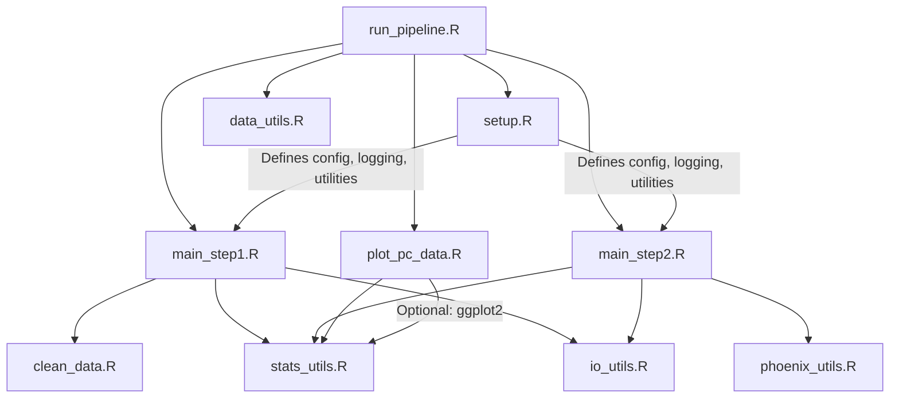

# PK Data Processing Pipeline

A modular R pipeline for pharmacokinetic (PK) data: raw data cleaning, Phoenix WinNonlin output processing, summary statistics, and reporting.

## Features
- Clean and map raw PK concentration data
- Process Phoenix WinNonlin outputs and (optionally) summary tables
- Generate arithmetic and geometric summary statistics
- Apply diagnostic exclusion criteria (Rsq, AUC%Extrap)
- Export results to Excel/CSV (multi-sheet)
- Comprehensive logging

## Quick Start

1. **Install required packages:**
   ```r
   install.packages(c("dplyr", "tidyr", "purrr", "openxlsx", "fs"))
   ```

2. **Configure your analysis:**  
   Edit `data_utils.R` for input/output files, column mappings, grouping variables, and settings.

3. **Run the pipeline:**
   ```r
   source("run_pipeline.R")  # Main entry point: runs all steps in order
   ```

   - `run_pipeline.R` will source `setup.R` first to initialize the environment, then run all pipeline steps in sequence.
   - You no longer need to source `setup.R` in `main_step1.R` or `main_step2.R`.

## Data & Configuration

- **Required columns:** `Subject`, `Time`, `Concentration`, `Cohort` (or mapped equivalents)
- **Grouping variables:**  
  - PC data: `pc_time_group_vars`, `pc_nontime_group_vars`
  - Phoenix parameters: `pp_group_vars`
- **Summary table:** Optional. If enabled, must contain `Subject`, `Time`, `Concentration` (and grouping variables). Controlled by `import_summary_table` in config.
- **Config options:**  
  Set in `data_utils.R` (see in-file comments for details)
  - `import_summary_table`: Set to `FALSE` to skip importing the summary table and pulling CXX/Cmax/CXX columns in the Phoenix step. Only the main Phoenix output will be processed.

## Outputs

- **Step 1 (PC Data):**  
  - `Output_files/Step_1/`: Cleaned CSV, wide-format Excel, summary Excel
- **Step 2 (Phoenix Parameters):**  
  - `Output_files/Step_2/`: Individual values Excel, summary Excel (with units), CXX and Cmax/CXX columns (if `import_summary_table = TRUE`)
- **Logging:**  
  - `Output_files/log/`: Timestamped log files

## File Structure

```
Pk_pipeline/
├── run_pipeline.R        # Main entry point: runs all steps
├── setup.R               # Environment, config, and utility initialization
├── main_step1.R          # Step 1: Data cleaning & PC summary
├── main_step2.R          # Step 2: Phoenix processing & summary
├── data_utils.R          # Configuration
├── clean_data.R          # Data cleaning functions
├── phoenix_utils.R       # Phoenix output processing
├── stats_utils.R         # Statistical analysis
├── io_utils.R            # Input/output utilities
├── plot_pc_data.R        # Plotting script
├── misc/                 # Supporting files (e.g., column lookup)
├── Output_files/
│   ├── Step_1/           # Step 1 outputs
│   ├── Step_2/           # Step 2 outputs
│   └── log/              # Log files
└── Input_files/          # Raw data files
```

## Project Architecture & Dependency Map



- **run_pipeline.R** is the main entry point. It sources `setup.R` (for environment, config, and utilities), then runs all pipeline steps in order.
- **setup.R** must be sourced first; it provides global variables, config, and utility functions for all other scripts.
- **main_step1.R** and **main_step2.R** no longer source `setup.R` themselves.
- Utility scripts (`clean_data.R`, `phoenix_utils.R`, `stats_utils.R`, `io_utils.R`) are sourced as needed by the main steps.

## Key Implementation Details

- **Column mapping:** Set in `data_utils.R` via `column_map`
- **Grouping variables:** Used for splitting and summary; must exist in data or single-group logic applies
- **Time points:** Set `summary_time_points` in config to extract CXX and Cmax/CXX columns (only if `import_summary_table = TRUE`)
- **Exclusion criteria:**  
  - `RG` flag: Rsq_adjusted < threshold (excludes select parameters)
  - `EX` flag: AUC%Extrap_obs > threshold (excludes select parameters)
- **BLOQ/zero handling:** Controlled by `bloq_value`, `handle_bloq`, `handle_zero` in config
- **Summary table import:** Controlled by `import_summary_table` in config. If `FALSE`, summary table is not read and CXX/Cmax/CXX columns are not generated in Step 2.

## Troubleshooting

- Ensure all required packages are installed
- Check file paths and column mappings
- Verify grouping variables exist in your data
- Review log files in `Output_files/log/` for details

## Project Template

For new projects:
```